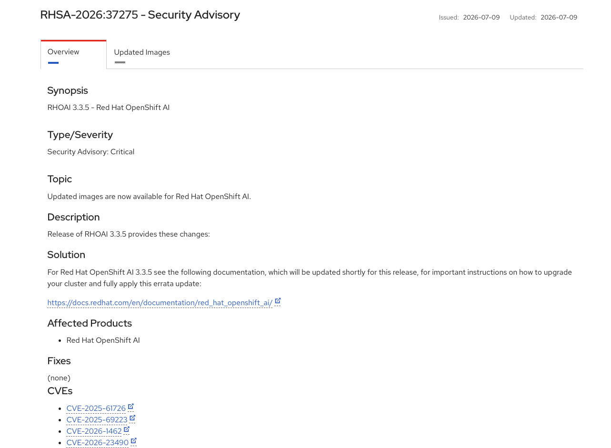
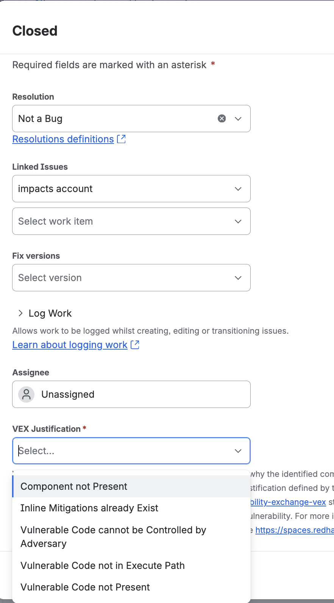

# Dealing with the CVEs {background-iframe="ambient/index.html"} 

## Addressing CVEs often feels like this:

{fig-align="center"}

## :hand: What is a CVE?

CVE (_Common Vulnerabilities and Exposures_) is an industry-wide reference code for specific known cybersecuirity issues. 

You can find more information about specific CVEs e.g. on:

- [GitHub Advisory Database](https://github.com/advisories)
- [National Vulnerability Database](https://nvd.nist.gov/)
- [CVE Program](https://www.cve.org/)
- [Red Hat CVE Database](https://access.redhat.com/security/security-updates)

## :tophat: Red Hat CVE Database

```{=html}
<iframe width="1500" height="700" src="https://access.redhat.com/security/security-updates/cve?q=&p=1&sort=updated+desc&rows=10&documentKind=Cve&products=Red+Hat+OpenShift+AI+(RHOAI)" title="Webpage example"></iframe>
```

## :tophat: Red Hat Products Errata

RH uses [this Tekton pipeline](https://github.com/konflux-ci/release-service-catalog/tree/production/pipelines/managed/rh-advisories) to create [a release wth an advisory](https://github.com/konflux-ci/release-service-catalog/tree/production/pipelines/managed/rh-advisories) to inform users about the present CVEs

::: {.fragment}
{fig-align="center" height="600"} 
:::

## :memo: CVE trackers on Jira

CVE trackers produced by the ProdSec will look like this:

::: {.fragment}
> CVE-2026-59885 rhoai/odh-trustyai-nemo-guardrails-server-rhel9: pyasn1: Denial of Service via crafted ASN.1 OBJECT IDENTIFIER [rhoai-3.3]
:::

::: {.fragment}
If you are an involved user, you should be cc'd on the ticket and you will get an email notifcation when the ticket is created
:::

::: {.fragment}
Alternatively, yoy might need a Jira query, e.g.

```bash
project = RHOAIENG AND text ~ "nemo-guardrails-server-rhel9" AND (summary ~ "CVE" OR labels = "CVE" OR issuetype = "Vulnerability") ORDER BY created DESC
```
:::

## :memo: Decomposing a CVE tracker

> <span style="color:red;">CVE-2026-59885</span> <span style="color:blue;">rhoai/odh-trustyai-nemo-guardrails-server-rhel9</span>: <span style="color:green;">pyasn1</span>: <span style="color:purple;">Denial of Service via crafted ASN.1 OBJECT IDENTIFIER</span> [<span style="color:orange;">rhoai-3.3</span>]

::: {.fragment .semi-fade-in}
<span style="color:red;">CVE-2026-59885</span>: _the CVE identifier_
:::

::: {.fragment .semi-fade-in}
<span style="color:blue;">rhoai/odh-trustyai-nemo-guardrails-server-rhel9</span>: _the potentially affected downstream component_
:::

::: {.fragment .semi-fade-in}
<span style="color:green;">pyasn1</span>: _the vulnerable dependency_
:::

::: {.fragment .semi-fade-in}
<span style="color:purple;">Denial of Service via crafted ASN.1 OBJECT IDENTIFIER</span>: _the vulnerability description_
:::

::: {.fragment .semi-fade-in}
<span style="color:orange;">[rhoai-3.3]</span>: _the affected product + version (stream)_
:::

## :thinking: OK, but what about upstream repositories?

You can also get signal about the CVEs on our upstream repositories, usually via Trivy GH action workflow. 

::: {.fragment}
```bash
Report Summary

┌─────────────────────────────────────────────────────────────────────────┬────────┬─────────────────┬─────────┐
│                                 Target                                  │  Type  │ Vulnerabilities │ Secrets │
├─────────────────────────────────────────────────────────────────────────┼────────┼─────────────────┼─────────┤
│ nemoguardrails/library/jailbreak_detection/requirements.txt             │  pip   │        0        │    -    │
├─────────────────────────────────────────────────────────────────────────┼────────┼─────────────────┼─────────┤
│ package-lock.json                                                       │  npm   │        0        │    -    │
├─────────────────────────────────────────────────────────────────────────┼────────┼─────────────────┼─────────┤
│ poetry.lock                                                             │ poetry │       29        │    -    │
├─────────────────────────────────────────────────────────────────────────┼────────┼─────────────────┼─────────┤
│ requirements.txt                                                        │  pip   │       25        │    -    │
├─────────────────────────────────────────────────────────────────────────┼────────┼─────────────────┼─────────┤
│ .venv/lib/python3.12/site-packages/chainlit/data/storage_clients/gcs.py │  text  │        -        │    1    │
└─────────────────────────────────────────────────────────────────────────┴────────┴─────────────────┴─────────┘
Legend:
- '-': Not scanned
- '0': Clean (no security findings detected)

poetry.lock (poetry)
====================
Total: 29 (HIGH: 29, CRITICAL: 0)

┌──────────────────┬─────────────────────┬──────────┬──────────┬───────────────────┬───────────────┬──────────────────────────────────────────────────────────────┐
│     Library      │    Vulnerability    │ Severity │  Status  │ Installed Version │ Fixed Version │                            Title                             │
├──────────────────┼─────────────────────┼──────────┼──────────┼───────────────────┼───────────────┼──────────────────────────────────────────────────────────────┤
│ cryptography     │ GHSA-537c-gmf6-5ccf │ HIGH     │ fixed    │ 46.0.5            │ 48.0.1        │ Vulnerable OpenSSL included in cryptography wheels           │
│                  │                     │          │          │                   │               │ https://github.com/advisories/GHSA-537c-gmf6-5ccf            │
├──────────────────┼─────────────────────┤          │          ├───────────────────┼───────────────┼──────────────────────────────────────────────────────────────┤
│ gitpython        │ CVE-2026-42215      │          │          │ 3.1.46            │ 3.1.47        │ GitPython is a python library used to interact with Git      │
│                  │                     │          │          │                   │               │ repositories. ...                                            │
│                  │                     │          │          │                   │               │ https://avd.aquasec.com/nvd/cve-2026-42215                   │
│                  ├─────────────────────┤          │          │                   │               ├──────────────────────────────────────────────────────────────┤
│                  │ CVE-2026-42284      │          │          │                   │               │ GitPython is a python library used to interact with Git      │
│                  │                     │          │          │                   │               │ repositories. ...                                            │
│                  │                     │          │          │                   │               │ https://avd.aquasec.com/nvd/cve-2026-42284                   │
│                  ├─────────────────────┤          │          │                   ├───────────────┼──────────────────────────────────────────────────────────────┤
│                  │ CVE-2026-44243      │          │          │                   │ 3.1.48        │ GitPython: GitPython: Arbitrary file write via crafted       │
│                  │                     │          │          │                   │               │ reference paths                                              │
│                  │                     │          │          │                   │               │ https://avd.aquasec.com/nvd/cve-2026-44243                   │
│                  ├─────────────────────┤          │          │                   ├───────────────┼──────────────────────────────────────────────────────────────┤
│                  │ CVE-2026-44244      │          │          │                   │ 3.1.49        │ GitPython is a python library used to interact with Git      │
│                  │                     │          │          │                   │               │ repositories. ...                                            │
│                  │                     │          │          │                   │               │ https://avd.aquasec.com/nvd/cve-2026-44244                   │
│                  ├─────────────────────┤          │          │                   ├───────────────┼──────────────────────────────────────────────────────────────┤
│                  │ GHSA-mv93-w799-cj2w │          │          │                   │ 3.1.50        │ GitPython: Newline injection in config_writer() section      │
│                  │                     │          │          │                   │               │ parameter bypasses CVE-2026-42215 patch, enabling RCE...     │
│                  │                     │          │          │                   │               │ https://github.com/advisories/GHSA-mv93-w799-cj2w            │
├──────────────────┼─────────────────────┤          │          ├───────────────────┼───────────────┼──────────────────────────────────────────────────────────────┤
│ langchain-core   │ CVE-2026-34070      │          │          │ 1.2.17            │ 1.2.22        │ langchain: path traversal in legacy load_prompt functions in │
│                  │                     │          │          │                   │               │ langchain-core                                               │
│                  │                     │          │          │                   │               │ https://avd.aquasec.com/nvd/cve-2026-34070                   │
│                  ├─────────────────────┤          │          │                   ├───────────────┼──────────────────────────────────────────────────────────────┤
│                  │ CVE-2026-44843      │          │          │                   │ 1.3.3, 0.3.85 │ LangChain vulnerable to unsafe deserialization of            │
│                  │                     │          │          │                   │               │ attacker-controlled objects through overly broad `load()`... │
│                  │                     │          │          │                   │               │ https://avd.aquasec.com/nvd/cve-2026-44843       
```
:::

## :thinking: How to prioritise CVE trackers?

::: {.fragment}
Within `Field Tab` of the CVE tracker, you should check the Severity
:::

::: {.fragment}
Within `Details` section of the CVE tracker, you should check the following fields:
:::

:::{.fragment}
- Embargo Status: if set to `True`, then this is likely a critical CVE that is not yet public, and you should treat it with caution 
:::

:::{.fragment}
- CVSS Score: the higher the score, the more critical; if CVSS Score is 7.0, you need to deal with it 
:::

:::{.fragment}
- Due Date: the higher the score, the more critical 
:::

## :test_tube: Step 1: Assess if you are truly vulnerable

Once assigned to a CVE tracker, you should assess if you are truly vulnerable by answwering the following questions:

:::{.fragment}
- is the vulnerable code actually shipped?
:::

::: {.fragment}
- is the vulnerable code actually used?
:::

:::{.fragment}
If the answer to these questions is `no`, you can potentially close the CVE tracker via __VEX__
:::

## :mechanical_arm: VEXing

You can close the CVE tracker via `Not a bug resolution` as follows:

:::: {.columns}
::: {.column width="30%"}
:::{.fragment}
{fig-align="left" height="600"}
:::
:::

::: {.column width="70%"}
:::{.fragment}
- the component would usually refer to the __vulnerable dependency__
:::

:::{.fragment}
- you will need to write a short justifcation for VEXing
:::

:::{.fragment}
- note that you also simply cannot close the CVE tracker, with `Won't Do` resolution, this is not permitted
:::

:::{.fragment}
- CVE trackers can be noisy so VEXing is not an uncommon practice
:::
:::
::::

## :arrow_up: Step 2: Upgrade / mitigate /extend

If you are truly vulnerable and VEXing is not an option, you should either: 

:::{.fragment}
- upgrade the vulnerable dependency to a fixed version, if it is available, or
:::

:::{.fragment}
- mitigate via configuraton hardening, disabling the vulnerable feature or any other viable means
:::

:::{.fragment}
- file exception (extend SLA "Service Level Agreement") if the above two options are not possible
:::

## :point_up: Upgrading the vulnerable dependency

First, establish if the CVE comes from:

:::{.fragment}
- a direct dependency (for Python, this would be found in e.g. `pyproject.toml` file)
:::

:::{.fragment}
- transitive dependency (for Python; this would be found only in e.g. `lock` files but not in toml)
:::

## :snake: Python upgrade workflow

The following workflow might be useful for upgrading a vulnerable Python dependency:

:::{.fragment}
:one: upgrade the direct dependency inside `pyproject.toml` file
:::

:::{.fragment}
:two: if the direct dependency can't be upgraded but the transitive package version is flexible, use centralized CVE Constraints (`dependencies/cve-constraints.txt`) and regenerate the lock file e.g. 

```bash
uv pip compile pyproject.toml \
  --constraint dependencies/cve-constraints.txt \
```
:::

:::{.fragment}
:three: If there are version conflicts that prevent constraint-based resolution:

```toml
[tool.uv]
override-dependencies = [
    # RHAIENG-AAAAA: CVE-XXXX-YYYY 
    "vulnerable_package>=x.y.z",
]
```
:::

## :heavy_plus_sign: Additional considerations

For the components that use AIPCC based indexes (aka most of our Python-based images from rhoai-3.5 onwards), you need to:

:::{.fragment}
:one: check if the version if on the AIPCC index
```bash
curl -s "https://packages.redhat.com/api/pypi/public-rhai/rhoai/3.5/cpu-ubi9/simple/<package>/" \
  | grep -oP '<package>-[0-9][^-]+' | sort -uV
```
:::

:::{.fragment}
:two: if the version is not on the AIPCC index, you might need to initiate a new onboarding request
:::

## :thumbsup: Validating the fix

When I review a CVE fix PR, I now only approve PRs iff:

:::{.fragment}
:one: the Konflux CI pipeline is green for all four architectures (x86_64, aarch64, ppc64le, s390x)
:::

:::{.fragment}
:two: there are no regressions on ODH tests
:::

:::{.fragment}
> it might be prudent to attach this evidence to the CVE tracker and PR, so that the reviewer can access it easily
:::
